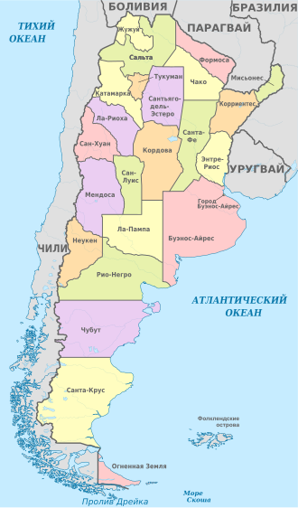
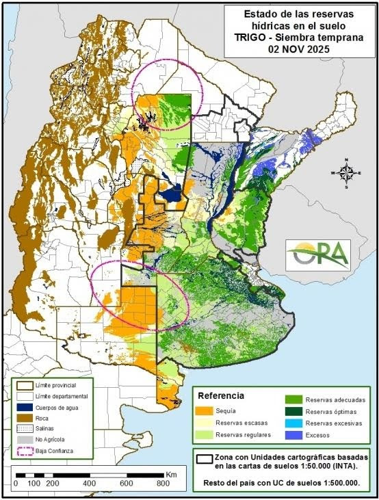
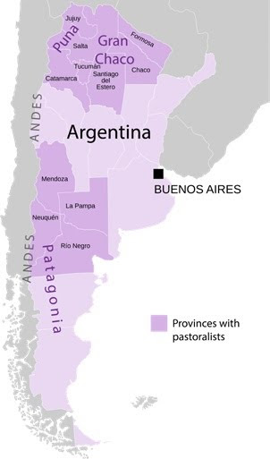
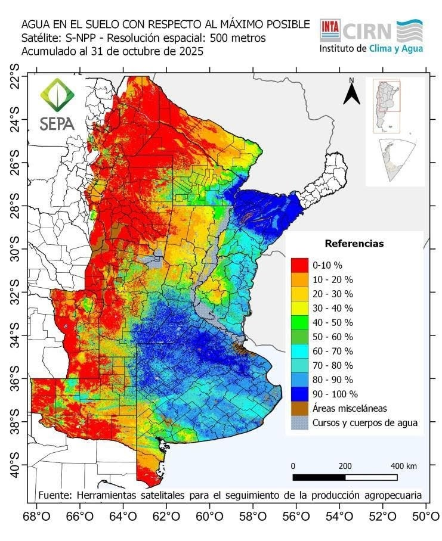

## Цель и задачи работы

**Цель работы:**
Комплексный анализ специализации АПК Аргентины, оценка его современного состояния, роли в национальной экономике и на мировом продовольственном рынке.

**Задачи работы:**

* Рассмотреть экономико-географическое положение и ресурсы страны.
* Дать макроэкономическую характеристику и определить место сельского хозяйства.
* Проанализировать структуру отраслей (растениеводство, животноводство, переработка).
* Выявить главные экспортные продукты и географию поставок.
* Исследовать актуальные проблемы и перспективы развития (AgTech).

---

## Общая информация по объекту исследования

* Аргентина — глобальная агропромышленная держава, обеспечивающая продовольственную безопасность в мире.
* АПК — главный макроэкономический фундамент: он приносит более 60% всей экспортной выручки.
* Земельный фонд огромен: около 47% площади страны (почти 119 млн га) составляют сельскохозяйственные угодья.
* Главная «житница» страны — регион Пампа, обладающий идеальным умеренным климатом и плодородными почвами.

---

## Макроэкономические показатели Аргентины

* В 2024 году страна достигла рекордного профицита торгового баланса (18,8 млрд USD).
* АПК выступает главным буфером экономики в период реформ.

**Основные макроэкономические индикаторы (оценка 2024 г. и прогноз):**

| Индикатор | 2024 | 2025 | 2026 | 2027 | 2028 |
| :--- | ---: | ---: | ---: | ---: | ---: |
| ВВП, млрд USD | 632,15 | 683,53 | 715,38 | 715,77 | 712,67 |
| Рост ВВП, % | -1,7 | 5,5 | 4,5 | 4,0 | 3,2 |
| Инфляция, % | 219,9 | 35,9 | 14,5 | 9,4 | 7,5 |
| Госдолг, % ВВП | 85,3 | 73,1 | 68,2 | 65,1 | 63,3 |
| Сальдо счёта, % ВВП | 1,0 | -0,4 | -0,3 | 0,2 | 0,6 |

---

## Классификация отраслей АПК Аргентины: Растениеводство

**Параметры производства и экспорта основных культур (прогноз 25/26 гг.):**

| Сельскохозяйственная культура | Площадь, млн га | Производство, млн т | Экспорт, млн т |
| :--- | ---: | ---: | ---: |
| Соя | 16,8 | 48,0–52,0 | 7,3 (зерно) + переработка |
| Кукуруза | 7,5 | 56,0 | 36,0–40,0 |
| Пшеница | 6,5 | 24,5 | 14,5–17,5 |
| Ячмень | 1,3 | 5,1 | 3,3 |
| Сорго | 0,78 | 3,0 | 1,5 |

---

## Условия для растениеводства: Влажность почвы

---

## Классификация отраслей АПК Аргентины: Животноводство и переработка

* **Животноводство:**
  * Разведение крупного рогатого скота мясного направления (экспорт свыше 920 тыс. тонн в год).
  * Экстенсивное пастбищное животноводство в засушливых регионах.
* **Перерабатывающая промышленность:**
  * Соевые заводы (высочайшая концентрация мощностей в мире).
  * Мясная индустрия и производство биотоплива (биоэтанол).

---

## Основные проблемы исследования: Экономика

* **Гиперинфляция и валютная нестабильность:** резкий рост производственных затрат для фермерских хозяйств.
* **Налоговое бремя:** исторически высокие экспортные пошлины дестимулируют производство и снижают мировую конкурентоспособность.
* **Инфраструктурные ограничения:** недостаток финансирования, проблемы с логистикой, энергоснабжением и падением уровня рек для экспорта.
* **Зависимость рынков:** доминирование одного покупателя в ряде сегментов (например, Китай закупает 73,8% всей говядины).

---

## Основные проблемы исследования: Экология

* **Климатическая волатильность:** чередование разрушительных засух (Ла-Нинья) и сильных наводнений, что наносит колоссальный урон урожаям.
* **Биологические угрозы:** эпидемии болезней (например, «кукурузная карликовость») и вредителей.
* **Деградация земель:** чрезмерно интенсивная эксплуатация плодородных почв Пампы.
* **Зависимость от осадков:** лишь 0,9% сельхозугодий орошается искусственно.

---

## Возможности решения или развития: Экономика

* **Дерегулирование:** отмена экспортных квот на зерновые и постепенное снижение пошлин.
* **Стабилизация:** сокращение государственного вмешательства и жесткая фискальная корректировка для снижения инфляции.
* **Инвестиции:** запуск специального режима для крупных инвестиций (RIGI) для стимулирования притока иностранного капитала.
* **Внешняя торговля:** достижение соглашения по зоне свободной торговли между блоком МЕРКОСУР и Европейским союзом.

---

## Возможности решения или развития: Инновации

* **Точное земледелие (AgTech):** использование дронов, спутникового мониторинга и платформ на базе искусственного интеллекта.
* **Биотехнологии:** Аргентина — 3-й по величине производитель биотехнологических культур (разработка ГМО-семян, устойчивых к засухе).
* **Индустрия 4.0:** автоматизация пищевой промышленности и внедрение блокчейн-трассируемости для соответствия мировым эко-стандартам.
* **Устойчивое развитие:** переход к регенеративному земледелию и производству экологически чистого топлива.

---

## Спасибо за внимание!

Доклад окончен. Буду рада ответить на ваши вопросы.